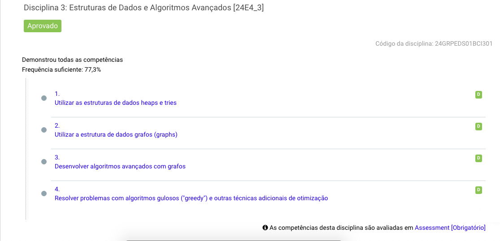

<h1 align="center">Estruturas de Dados e Algoritmos Avançados</h1>

<h3>📚 Sobre:</h3> 
Durante a disciplina, me aprofundei em estruturas de dados complexas, como Heaps e Tries, e explorei a manipulação de grafos para resolver problemas robustos. Além disso, desenvolvi algoritmos avançados, incluindo técnicas de otimização como algoritmos gulosos ("greedy"), que me permitiram abordar questões de otimização com eficiência e criatividade.

<h3> 📂 Estrutura do Repositório </h3> 

O repositório está organizado em **três TP's (Testes de Performance)** e um **Assessment Final**. Aqui você encontrará:

- **Códigos-fonte** dos algoritmos e estruturas de dados implementados.
- **Explicações detalhadas** sobre cada conceito abordado.
- **Exercícios práticos** resolvidos durante a disciplina.

#### **TP1**
- *(Adicione os detalhes do TP1 aqui, se houver.)*

#### **TP2**
- *(Adicione os detalhes do TP2 aqui, se houver.)*

#### **TP3**
- *(Adicione os detalhes do TP3 aqui, se houver.)*

#### **Assessment Final**
- *(Adicione os detalhes do Assessment Final aqui, se houver.)*

<h3>🛠️ Ao longo dessa disciplina, as seguintes competências foram demonstradas:</h3>
  
- **Utilização de estruturas de dados como Heaps e Tries.**
- **Manipulação e aplicação de grafos (graphs) em problemas reais.**
- **Desenvolvimento de algoritmos avançados com grafos.**
- **Resolução de problemas utilizando algoritmos gulosos e outras técnicas de otimização.**

   
  

